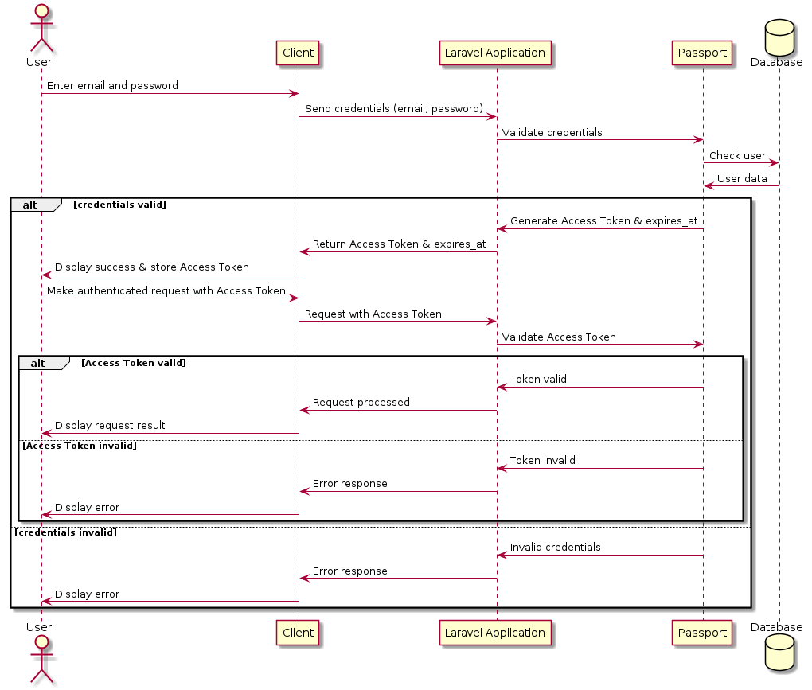
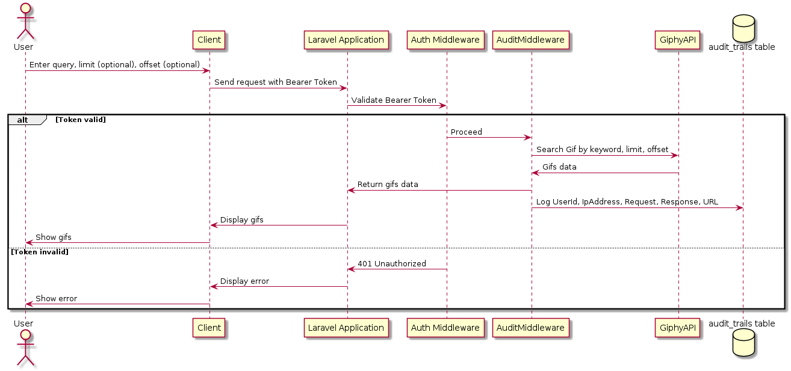
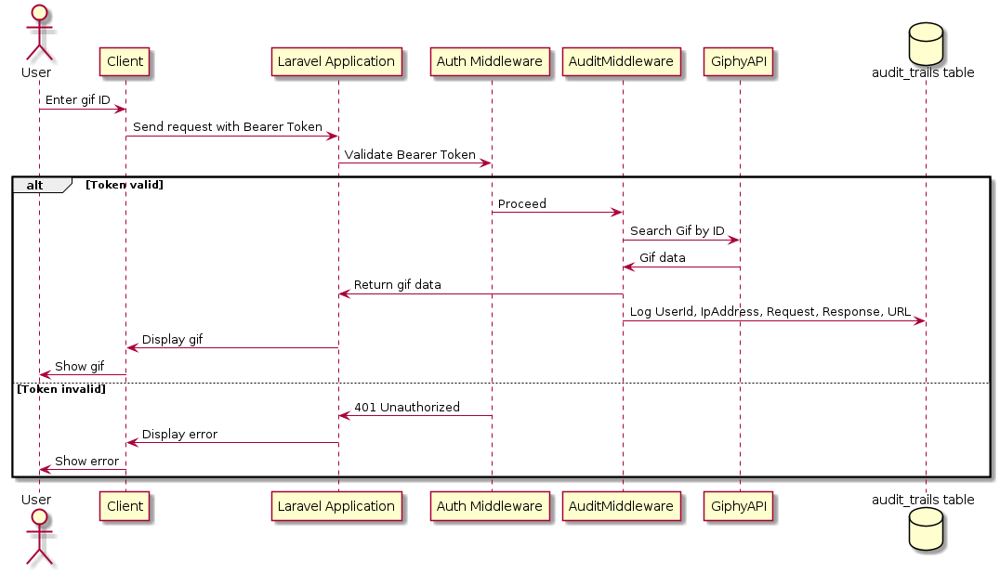
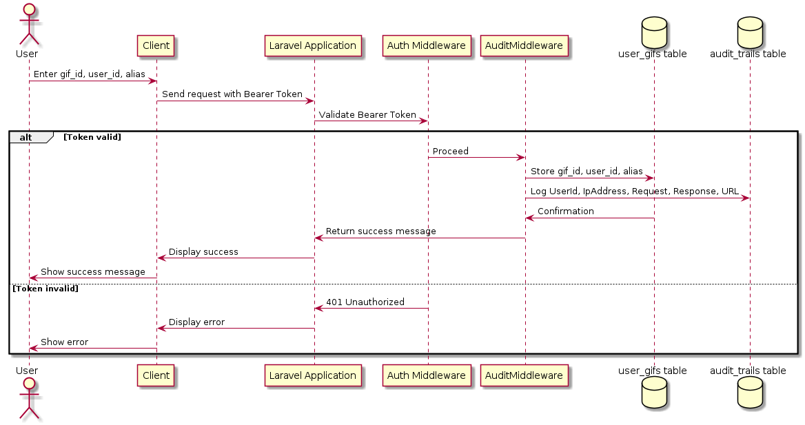
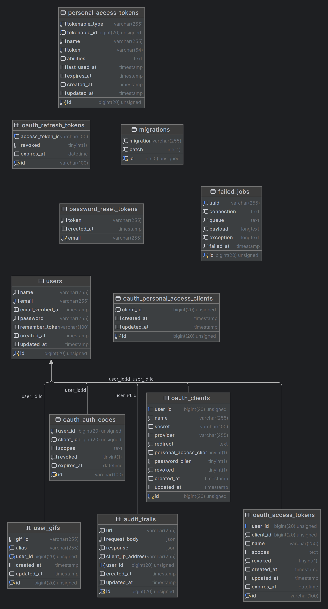

# GIPHY API Integration Challenge

## Introduction

This project is designed to showcase the integration with the GIPHY API through the development of a custom REST API. It includes OAuth 2.0 authentication, demonstrating secure interactions with external APIs, user authentication, and efficient data retrieval and manipulation.

## Table of Contents

1. [Introduction](#introduction)
2. [Requirements](#requirements)
3. [Getting Started](#getting-started)
    - [Installation](#installation)
    - [Usage](#usage)
    - [Testing](#testing)
4. [Documentation](#documentation)
    - [Use Cases Diagrams](#use-cases-diagrams)
    - [Sequence Diagrams](#sequence-diagrams)
    - [DER Diagram](#der-diagram)
5. [References](#references)

## Requirements

- Docker and Docker Compose
- Git
- Postman

## Getting Started

### Installation

**1. Clone the Repository**

Clone this repository to your local machine using Git and navigate into the project directory:
   ```bash
   git clone https://github.com/pmirand6/prex-challenge.git
   cd prex-challenge
   ```

**2. Build and Start Docker Containers**

Use Docker Compose to build and start the necessary containers:
   ```bash
   docker-compose up -d --build
   ```

**3. Install Project Dependencies**

Install dependencies within the Docker container:
   ```bash
   docker exec -it prex-challenge-app composer install
   ```

**4. Database Migrations and Seeding**

Set up and populate the database:
   ```bash
   docker exec -it prex-challenge-app php artisan migrate
   docker exec -it prex-challenge-app php artisan db:seed
   ```

**5. Generate OAuth 2.0 Keys**

Generate keys for OAuth 2.0 authentication:
   ```bash
   docker exec -it prex-challenge-app php artisan passport:install
   ```

### Usage

**Access the API** at `http://localhost:8498` or through the configured port mapped to container's port 80.

**Seeded User Credentials:**

- Email: test@prex-challenge.com
- Password: password

**API Endpoints:**
- `POST /api/login`
- `GET /api/gifs/search`
- `GET /api/gifs/:id`
- `POST /api/user-gifs`

**Postman Collection:** Explore the API with the provided [Postman Collection](https://documenter.getpostman.com/view/3105220/2sA2rDy1ry).

### Testing

Ensure the application is correctly set up and execute tests:

1. **Prepare the Test Database:**
   ```bash
   docker exec -it prex-challenge-app touch database/database.sqlite
   ```
2. **Optimize the Application:**
   ```bash
   docker exec -it prex-challenge-app php artisan optimize
   ```
3. **Execute the Tests:**
   ```bash
   docker exec -it prex-challenge-app php artisan test
   ```

## Documentation

### Use Cases Diagrams

- **User Authentication**
  
- **User Gif Interaction**
  

### Sequence Diagrams

- **User Authentication**
  
- **User Search Gif by Keyword**
  
- **User Search Gif by ID**
  
- **User Save Favorite Gif**
  

### DER Diagram

- **Database Entity Relationship**
  

## References

- Laravel: [Visit Laravel](https://laravel.com/)
- GIPHY API: [Visit GIPHY API](https://developers.giphy.com/)
- Docker Image: [pmirand6/php82-apache-composer](https://hub.docker.com/r/pmirand6/php82-apache-composer)