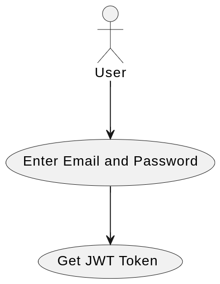
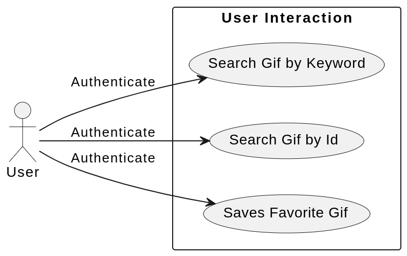

# GIPHY API Integration Challenge

## Description

This project demonstrates integration with the GIPHY API by developing a custom REST API that includes OAuth 2.0 authentication. It showcases the ability to securely interact with external APIs, authenticate users, and offer a streamlined interface for efficient data retrieval and manipulation.

## Requirements

- Docker
- Docker Compose
- Git
- Postman (recommended for API testing)

## Getting Started

### Installation

1. **Clone the Repository**

   Begin by cloning this repository to your local machine using Git:

   ```bash
   git clone https://github.com/pmirand6/prex-challenge.git
   cd prex-challenge
   ```

2. **Build and Start Docker Containers**

   Execute the following command to build and initiate the Docker containers:

   ```bash
   docker-compose up -d --build
   ```

3. **Install Project Dependencies**

   With the containers up and running, install the project dependencies using Composer:

   ```bash
   docker exec -it prex-challenge-app composer install
   ```

4. **Database Migrations and Seeding**

   Execute these commands to set up the database tables and populate them with sample data:

   ```bash
   docker exec -it prex-challenge-app php artisan migrate
   docker exec -it prex-challenge-app php artisan db:seed
   ```

5. **Generate OAuth 2.0 Keys**

   Generate the necessary keys for OAuth 2.0 authentication with this command:

   ```bash
   docker exec -it prex-challenge-app php artisan passport:install
   ```

### Usage

Once the Docker container is operational, the API can be accessed at `http://localhost:8498` or through any other port you've configured to map to the container's port 80.

#### Seeded User Credentials:

```plaintext
Email: test@prex-challenge.com
Password: password
```

#### API Endpoints

The API offers the following endpoints:
```plaintext
POST /api/login
GET /api/gifs/search
GET /api/gifs/:id
POST /api/user-gifs
```

#### Postman Collection
In the published [Postman Collection](https://documenter.getpostman.com/view/3105220/2sA2rDy1ry) you will find a set of requests that demonstrate how to interact with these endpoints.


#### Testing

##### Application Tests:

To ensure proper application testing, follow these steps:

- **Prepare the Test Database:**

  ```bash
  docker exec -it prex-challenge-app touch database/database.sqlite
  ```

- **Optimize the Application:**

  This step ensures the database location is correctly recognized during testing:

  ```bash
  docker exec -it prex-challenge-app php artisan optimize
  ```

- **Execute the Tests:**

  Run the tests with the following command:

  ```bash
  docker exec -it prex-challenge-app php artisan test
  ```

# Documentation

### Use Cases Diagrams

#### User Authentication



#### User Gif Interaction
